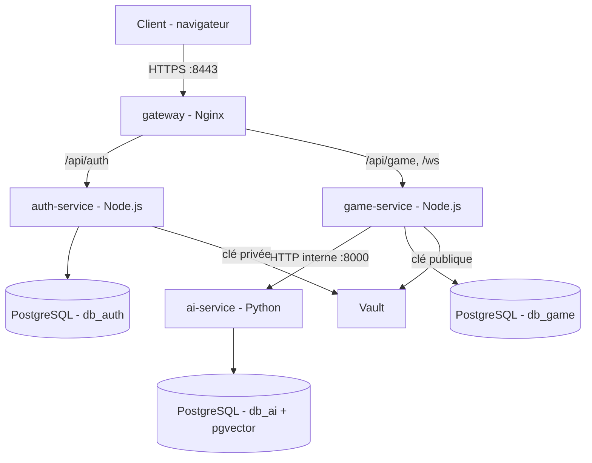
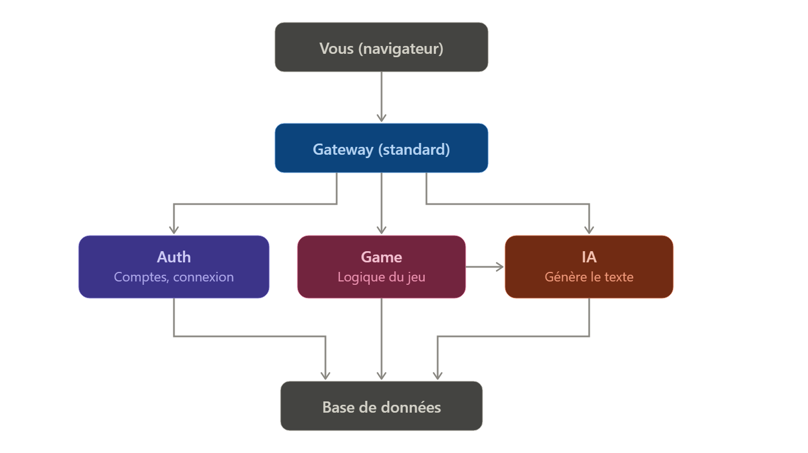

# Rôle de chaque fichier et dossier

## Fichiers à la racine

- **`.env.example`** → modèle de configuration avec des valeurs bidon. Contiendra : les mots de passe des 3 bases, le `JWT_SECRET` partagé, et les URLs de connexion utilisées par le script de remplissage.
- **`.gitignore`** → liste de ce qu'on interdit d'envoyer sur Git. Contient : `.env`, les certificats, `node_modules/`, `__pycache__/`.
- **`Makefile`** → raccourcis de commandes. Contient : `up`, `down`, `re`, `logs`, `ps`, `clean`, `seed`.
- **`README.md`** → notice d'installation humaine. Contient : les étapes pour démarrer, la liste des services.
- **`podman-comp# Les microservices dans Transcendence

## 1. C'est quoi, un microservice ?

Définition de référence (Martin Fowler & James Lewis, 2014) : un petit service autonome, dans son propre processus, qui communique via des mécanismes légers (souvent HTTP/REST), construit autour d'une capacité métier précise, déployable indépendamment.

---

## 2. Les services

Le projet est decoupé en 3 services : auth, game et ia.

## 3. La communication interservices

Si chaque action de jeu devait faire un aller-retour réseau vers `auth-service` pour vérifier un token, on ajouterait de la latence sur chaque message WebSocket

JSON Web Token : Un pass numérique signé une fois par le service et qui permet une connexion illimité
**un JWT est auto-suffisant.**

Ici, on va plus loin qu'une simple clé partagée (HS256) : on utilise du **RS256 asymétrique**.

- `auth-service` détient la **clé privée** → lui seul peut *signer* un token
- `game-service` ne détient que la **clé publique** → il peut *vérifier* qu'un token est authentique, mais ne pourrait jamais en forger un valide même si son code était compromis
- Les deux clés vivent dans **Vault**, à deux chemins distincts  chacun protégé par sa propre policy

même si `game-service` était compromis, l'attaquant ne pourrait pas émettre de faux tokens.

| Service | Rôle | Techno | Exposé publiquement |
|---|---|---|---|
| `gateway` | Reverse-proxy + sert le frontend (SPA) | Nginx | Oui (port 8443) |
| `auth-service` | Inscription, login, émission du JWT | Node.js | Non (via gateway) |
| `game-service` | État de jeu, WebSocket temps réel | Node.js | Non (via gateway) |
| `ai-service` | LLM + RAG (le Maître du Jeu virtuel) | Python/FastAPI | Non, jamais |
| `postgres` | Persistance | PostgreSQL + pgvector | Non |
| `vault` | Secrets + clés JWT | HashiCorp Vault | Non |

PostgreSQL (souvent appelé "Postgres") est un système de gestion de base de données relationnelle (SGBD). C'est l'un des outils les plus robustes et utilisés au monde.
Le joueur se connecte sur PostgreSQL, le backend lui donne un JWT pour qu'il puisse naviguer, et le backend utilise Vault en arrière-plan pour récupérer discrètement les clés d'API nécessaires pour faire tourner le site et l'IA.

--- 

---

Étape 1 : ouvre le site. Navigateur envoie une demande. Elle arrive chez le Gateway, qui joue le rôle d'un standard téléphonique : il regarde ce que vous voulez et vous redirige vers le bon "bureau".
Étape 2 : Vous vous inscrivez ou vous connectez. Le Gateway vous envoie chez Auth. Ce bureau vérifie votre mot de passe et note dans la base de données que vous existez.
Étape 3 :  Vous jouez. Le Gateway vous envoie cette fois chez Game. C'est ce bureau qui gère l'état de la partie (où vous êtes, ce qui se passe).
Étape 4 : Le jeu a besoin de texte généré par l'IA. Game va lui-même demander de l'aide à IA (vous, en tant que joueur, ne parlez jamais directement à IA c'est toujours Game qui fait l'intermédiaire).
Étape 5 : Tout se range. Chacun des trois services note ce qu'il doit garder dans la base de données, qui est juste une grosse armoire à fiches partagée.

dossier gateway

containerfile : C'est ce fichier que Podman lit pour fabriquer le conteneur qui fera tourner Gateway.
nginx.conf :  "si quelqu'un demande /api/auth/..., envoie-le au service Auth ; si c'est /api/game/..., envoie-le au service Game. Nginx est le programme qui lit ce fichier et fait vraiment la redirection.
certs/ : contiendra fichiers de sécurité pour que la connexion avec le site chiffrée.

dossier service
package.json == include
index.js == .cose.yml`** → le plan d'assemblage de tout le système. Contient : les 5 blocs (gateway, auth, game, ia, postgres), le réseau, le volume.

## `database/`

- **`init/`** → des fichiers `.sql` numérotés, exécutés dans l'ordre 
- **`content/universes/`** → le vrai contenu de vos univers de jeu (lore, PNJ, quêtes, monstres...), écrit en JSON/Markdown, un dossier par univers.

## `frontend/`

- **`package.json`** → liste des outils du frontend (`vite`, `typescript`).
- **`tsconfig.json`** → réglages du compilateur TypeScript.
- **`index.html`** → la seule vraie page HTML, point d'entrée du navigateur.
- **`src/main.ts`** → le tout premier fichier exécuté, lance l'affichage de la page actuelle.
- **`src/router.ts`** → décide quelle page afficher selon l'adresse visitée.
- **`src/pages/home.ts`** → le contenu d'une page précise (ici, l'accueil). Vous en ajouterez d'autres au même endroit au fur et à mesure (`login.ts`, `game.ts`...).

## `gateway/`

- **`containerfile`** → recette en 2 étapes : construit le frontend, puis le sert avec Nginx.
- **`nginx.conf`** → dit où rediriger chaque type de demande (`/api/auth/` → auth, `/api/game/` → game, `/ws/` → game, tout le reste → le site statique).
- **`certs/`** → dossier vide dans le repo, destiné à recevoir vos 2 fichiers de certificat générés localement (jamais committés).

## `services/auth/`

- **`containerfile`** → recette pour fabriquer l'image de ce service.
- **`package.json`** → outils : `express`, `bcrypt`, `jsonwebtoken`, `pg`.
- **`src/index.js`** → le code : inscription, connexion, émission du jeton (signé avec `JWT_SECRET`).

*(Pas de `vaultClient.js` ici, contrairement à l'ancienne version — plus besoin, puisqu'on lit directement `process.env.JWT_SECRET`.)*

## `services/game/`

- **`containerfile`** → même principe que `auth`.
- **`package.json`** → outils : `express`, `ws`, `axios`, `jsonwebtoken`, `pg`.
- **`src/index.js`** → le code : vérifie le jeton (même `JWT_SECRET` qu'`auth`), gère le WebSocket, appelle `ia` quand il faut de la narration.

*(Pas de `vaultClient.js` ni de `middlewares/verifyJwt.js` séparé — la vérification est directement dans `index.js`, en une petite fonction, pour rester simple.)*

## `services/ia/`

- **`containerfile`** → recette basée sur Python.
- **`requirements.txt`** → outils : `fastapi`, `uvicorn`, `pydantic`.
- **`app/__init__.py`** → fichier vide, dit à Python que ce dossier est un module.
- **`app/main.py`** → le code : reçoit une demande, renvoie du texte généré (pour l'instant, une phrase fixe en attendant un vrai LLM).

## `scripts/`

- **`package.json`** → outils : juste `pg`.
- **`seed-content.js`** → lit tout `database/content/` et remplit les vraies tables avec, lancé via `make seed`.